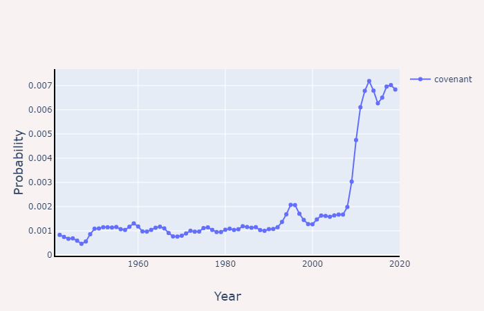

# Search MoDB

***
### Why Mormonism? 
This app lets you search for the frequency of words/phrases within a database of Mormon periodicals (hence, MoDB). I left the LDS church in 2016, and this app started as a way for me to explore the linguistic, doctrinal, and cultural evolution of the LDS church over time. 

### What I learned
This project was also a springboard for me to build and deploy my first web app ever. I used Dash, and as a result, I learned way more HTML, CSS, and JavaScript than I anticipated, and I discovered that I really enjoy designing UIs. This particular UI was initially inspired by the image stitching app from the Dash sample app gallery: https://github.com/plotly/dash-sample-apps/tree/dash-stitching/apps/dash-stitching

### Current iteration
I will eventually make it possible to search from all of the major, official church publications. Currently, the database only contains the archives of General Conference from 1942 to the present day. For all the non-Mormons out there, General Conference is a biannual conference that is the primary vehicle through which the leadership of the church provides encouragement, moral guidance and correction, and doctrinal exposition. 

### Future iterations
I hope to soon implement the following:
* Transparent colored overlays on the graph, depicting the tenure of each prophet/president of the church. 
* An option to see different results for messaging to men (i.e., priesthood session) and women (i.e., women's session) at General Conference. 
* Integration with Google Ngram corpus; this will allow you to compare religious and secular trends for a particular word/phrase. 
* Topic modeling, correlations and anti-correlations between words, sentiment analysis, and a few other natural language processing analyses. 

I hope you find this little project useful. 
***
## Contributors

* Daniel Wood
* [Nicolette Fendon](https://github.com/nicolette-verone)
